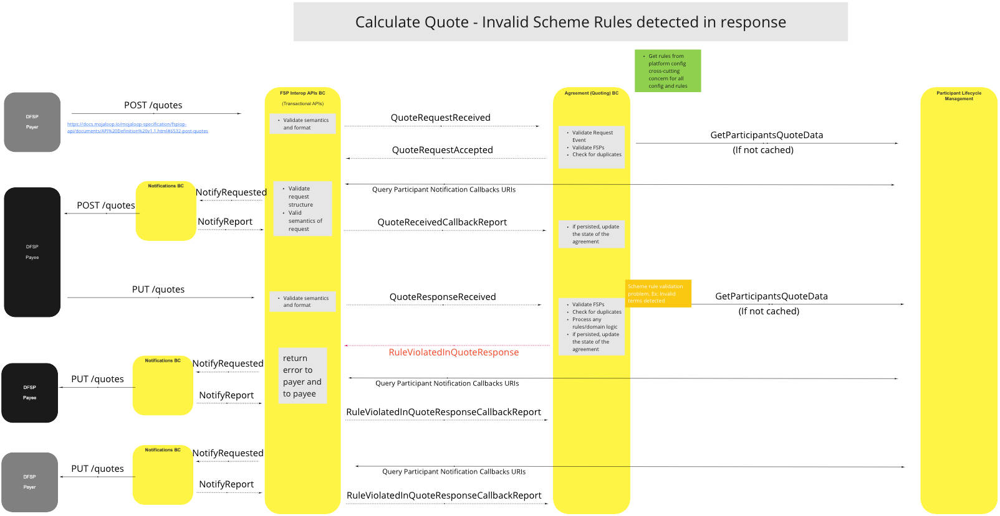

# Quoting/Agreements BC

The Quoting and Agreements Bounded Context provides Participants with quotations for undertaking transfers, and records the participant accept/reject responses.

## Terms

The following terms are used in this BC, also known as a domain.

| Term | Description |
|---|---|
| Participant | Financial Services Provider |

## Functional Overview

>

## Use Cases

### Calculate Quote - Happy Path

This process obtains an array of relevant Participant data including status flags, calculates the cost of Transfer including fees, and provides it to the Participant/s.  It also notes and stores the Participant response, i.e.: accept or reject the quote.

### Flow Diagram

>

### Get Quote - Happy Path

Process to obtain and deliver existing Quote details to Participant/s on request.

### Flow Diagram

>

### Transfers Velocity Rule Evaluation/Trigger

Process that maintains a counter to ensure that relevant transfer velocity rules are maintained and that events are recorded.

### Flow Diagram

>

### Calculate Quote - Invalid Quote Request

Process that enables the system to invalidate quote requests by monitoring and responding to invalid Request Events, FSPs, or duplicate requests.

### Flow Diagram

>

### Calculate Quote - Invalid FSPs

Process that enables the system to invalidate FSP quote requests where the FSP details mismatch the original Quote for either one or both Participants.

### Flow Diagram

>

### Calculate Quote - Invalid Scheme Rules Detected In Request

Process to enable the system to invalidate quote requests where Scheme Rules are violated, by one or more Participants, for example where Quote Period Limit reached.

### Flow Diagram

>

### Calculate Quote - Invalid Scheme Rules Detected In Response

Process to enable the system to invalidate quote reponses where Scheme Rules are violated by one or more Participants, for example, where invalid terms are detected.

### Flow Diagram

>

## Canonical Quote Model

The canonical model stores the following details of quotations in the Quotes & Agreements BC:

 - Quote ID
 - Transaction ID
 - Participants
   - payerId
   - payeeId
 - Payer
   - Participant
     - participantId
     - roleType <-- payer
   - Amount Requested (initial amount)
     - Value (number)
     - Currency (ISO currency code)
    - Amount to send (including fees, etc.)
      - Value (number)
      - Currency (ISO currency code)
 - Payee(s) (one or more - should all be added to the "Amount to send")
   - '#'
     - Participant
       - participantId
       - roleType <-- Identify why this "payee" is receiving this amount, i.e.: fee, recipient, etc.
       - reason
       - Amount to receive
         - value (number)
         - currency (ISO currency code)
 - Extensions

## Concluding comments

 * No red flag issues have been observed in the overall BC and Reference Architecture design.
 * We need to better understand/calrify the "GET" via "POST" pattern:
   * Should a "GET" event be a simple Restful "GET", or does the system need to support the "GET" from duplicate posts?
   * Are we required to serve "GET" requests that include FSP details at a later date?

<!--## Notes -->

<!-- Footnotes themselves at the bottom. -->
[^1]: Common Interfaces: [Mojaloop Common Interface List](../../commonInterfaces.md)