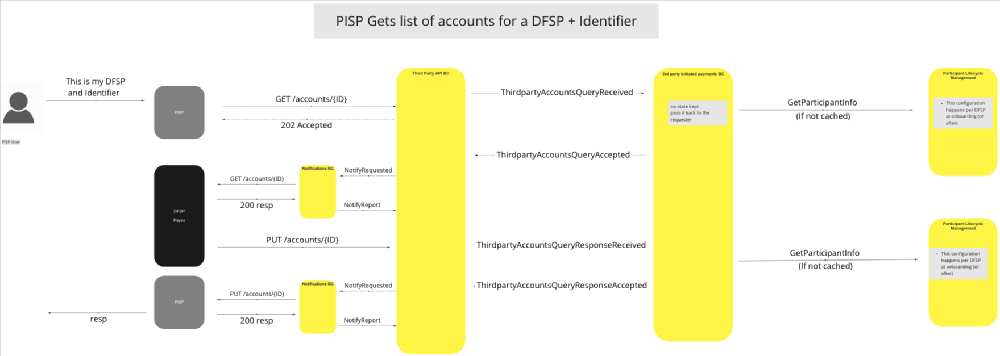
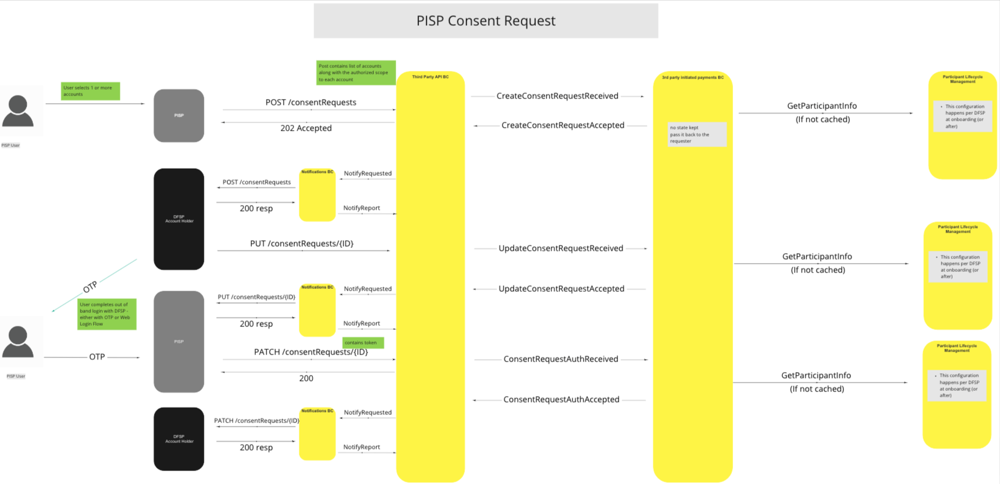
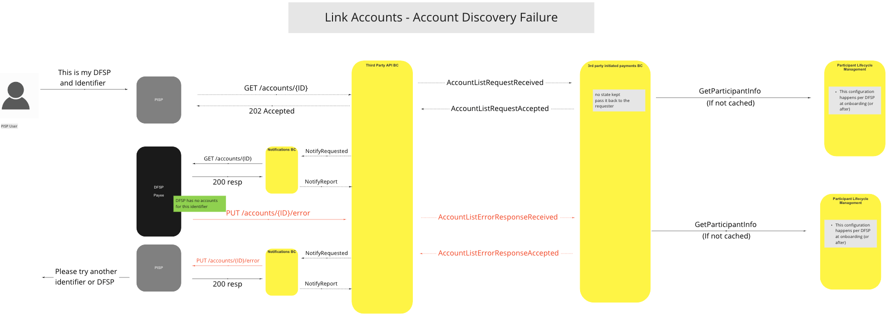
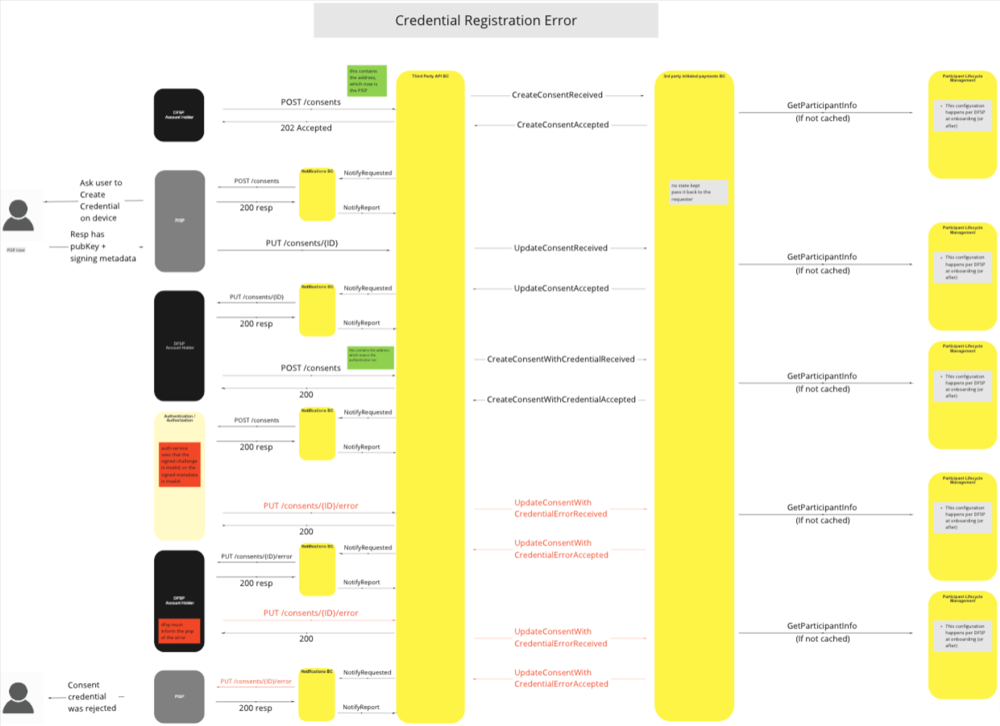
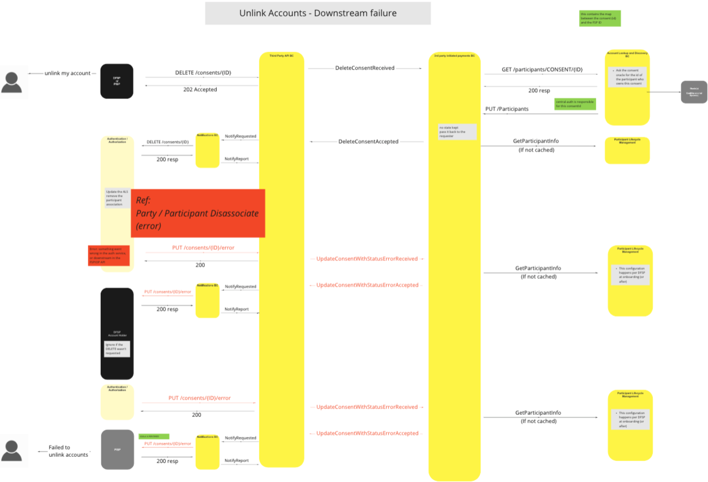
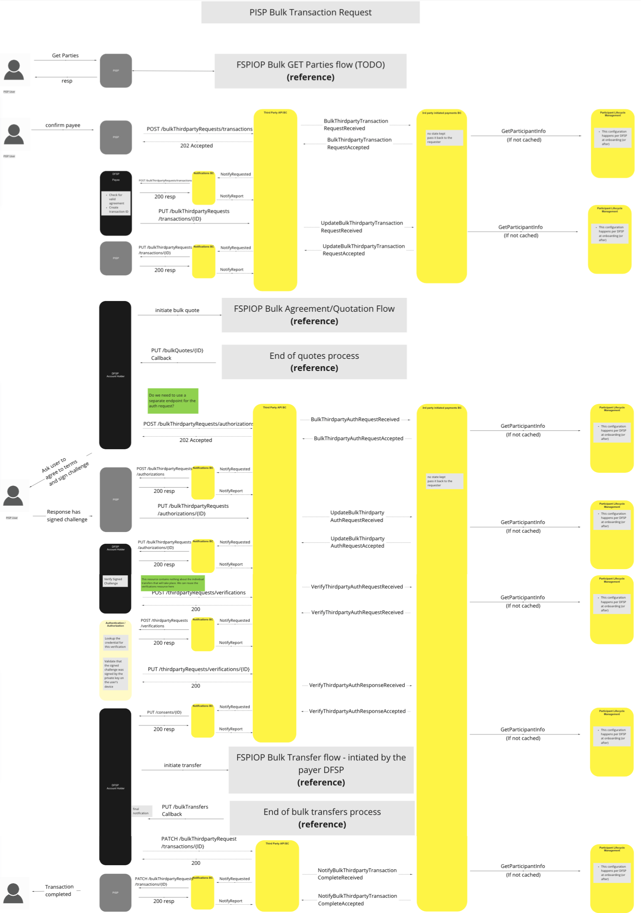

# Third Party API BC

The Third Party API BC has been implemented with the Mojaloop 2.0 Reference Architecture to enable third-party PISP Operators (typically applications) to interact with the platform.  Please note that unless otherwise stipulated, all BC references pertain to the various Mojaloop components or Bounded Contexts (BCs).

## Terms

The following common terms are used in this BC:

| Term | Description  |
| ---- | ------------ |
| PISP | Payment Initiation Service Provider |
| DFSP | Digital Financial Service Provider (Bank) |
| User | DFSP/PISP client (as indicated) |

## Use Cases

**Note:** Our Use Cases cover two specific scenarios:

| Scenarios | Description |
| --------- | ----------- |
| Linking | PISP Housekeeping activities. |
| Transfer | PISP Transfer initiation activities. |

### Linking Scenarios

### PISP Gets supported DFSPs

#### Description

PISP requests a list of DFSPs supported by the system.

#### Flow Diagram

>

### PISP Gets list of accounts for a DFSP + Identifier

#### Description

PISP requests a list of DFSP Accounts and Account Identifiers.

#### Flow Diagram

>

### PISP Consent Request

#### Description

PISP requests access consent to specific (scoped) Accounts details.

#### Flow Diagram

>

### DFSP Issue Consent

#### Description

In order to fulfil the PISP request for consent to access a User's account details, the DFSP issues a Consent Request to the User asking them to indicate consent via their device.

#### Flow Diagram

> 

### Unlink Accounts - Hub Hosted Auth

#### Description

A request is made via the DFSP to revoke PISP access consent for a User Account.  Both the DFSP and the User are provided with notification once access consent has been revoked.

#### Flow Diagram

>

### Link Accounts - Account Discovery Failure

#### Description

PISP User issues Account Discovery request containing the incorrect DFSP Identifier.  The User is notified and advised to check and retry.

#### Flow Diagram

>

### Link Accounts - DFSP Rejects Consent Request

#### Description

PISP User issues request to link to DFSP-held Accounts with an incorrect Account scope which the DFSP rejects, noting the reason for the rejection to the PISP User and suggesting that they check their request and retry.

#### Flow Diagram

>

### Credential Registration Error

#### Description

PISP requests User to create an authorisation credential consenting to PISP interaction with DFSP held Account scope.  The PISP is notified that the DFSP has rejected the Registration due to invalid data in the signed challege or metadata.  The PISP User is notified.

#### Flow Diagram

>

### Unlink Accounts - Consent not found

#### Description

The PISP or DFSP receives a request to unlink a PISP User Accounts.  The request is rejected upon inspection as the Account Lookup & Discovery Oracle reports that the Participant that owns the Account does not include the correct Consent ID.  The 3rd Party Initiated Payments BC issues a DeleteConsentFailed rejection message to the PISP/DFSP User.

#### Flow Diagram

>

### DSPF Rejects OTP/Auth Token from PISP

#### Description

The User selects one or more bank accounts to link via their PISP and uses an out-of-bankdwidth service to complete the linking request using either an OTP, or Web Login flow.  Due to an expired or incorrect token being used, the link request is rejected.

#### Flow Diagram

>

### Unlink Accounts - Downstream Failure

#### Description

The PISP/DFSP User receives a confirmation request  to unlink accounts from their profile.  Once the confirmation is sent, the system encounters an error in either the FSPIOP or Authentication step of the transaction, and the request is declined.

#### Flow Diagram

>

### Transfer Scenarios

### Third Party Initiated Transaction Request

#### Description

The PISP User initiates a Transfer request via the PISP System which requests the Participant (Payee) details from the Mojaloop Switch via the FSPIOP API BC and presents them to the User for confirmation.  Upon receipt of confirmation from the PISP User, the PISP System initiates the Transfer request via the Mojaloop 3rd-Party API BC.  The 3rd-Party Initiated Payments BC is engaged to obtain Participant info where it has not been cached by the system and deliver it to the to the PISP System.

***Note:*** *The 3rd-Party Initiated Payments BC does not retain the Participant states: it serves but does not store data*

The 3rd-Party API BC notifies the DFSP Payee System of a pending transaction which is checked for a valid Agreement and, if validated, the DFSP System creates a unique Transaction ID which is applied to the Transfer and returned to the PISP System via the 3rd-Party API BC.

Having completed this segment of the transaction, the DFSP Account Holder issues a challenge (authorization request token) to the PISP User, and notifies the PISP System via the 3rd-Party API BC.  The PISP User responds to the challenge to the PISP System, which then verifies the User response with the DFSP Account Holder System, ensuring that Challenge (token) was signed by the Private Key on the User's device via the 3rd-Party API BC.  Once validated, the PISP System notifies the DFSP Account Holder System via the 3rd-Party API BC, and the DFSP Account Holder System initiates the Transfer via the Mojaloop FSPIOP API BC.  

Once the Transfer has been concluded the DFSP Account Holder System notifies the PISP System via the 3rd-Party API BC, updates the Participant Info via the 3rd-Party Initiated Payments BC, and notifies the PISP/PISP User that the Transfer has been completed.

#### Flow Diagram

>

### PISP Bulk Transaction Request

#### Description

***Note:*** *In the interests of compacting this workflow description, it is necessary for the reader to under that the 3rd-Party API BC and the 3rd-Party Initiated Payments BC work in concert to maintain the Bulk Transaction Participant Information.  The interaction between the two BCs will not be specifically noted, but will be assumed as follows: where the 3rd-Party API BC updates Participant Information, and where the Participant Information is not cached, the 3rd-Party Initiated Payments BC will request the missing data from the Participant Lifecycle Management BC and deliver it to the 3rd-Party API BC for inclusion in the Transaction information being presented to the DFSP/PISP systems.*

A PISP User initiates a Bulk Transfer request via their PISP application/device. Upon receipt of the Transaction initiation request, the PISP system initiates the Bulk GET Parties workflow FSPIOP API BC. The PISP User is asked to confirm the Participants (Payee), whereafter the PISP system makes use of the 3rd-Party API BC to initiate the Transaction via the 3rd-Party Initiated Payments BC. Where the Participants information has not been cached, the 3rd-Party Initiated Payments BC requests it from the Participant Lifecycle Management BC, and passes it back to the 3rd-Party API BC.

The 3rd-Party API BC sends a notification via the Notifications BC to the DFSP Payee system to check that the transaction request has a valid agreement. If a valid agreement is in place, the DFSP Payee system issues a Transaction ID and returns a transaction update to the Switch via the 3rd-Party API BC. The 3rd-Party API BC updates the Transaction state via the 3rd-Party Initiated Payment BC, and sends a notification to the PISP noting the Transaction state via the Notifications BC.

The DFSP Account Holder initiates a Bulk Agreement/Quote process via the FSPIOP BC, updates the 3rd-Party API BC, and issues a message to the PISP User requesting them to agree to the terms of the Agreement/Quote by signing the message using their device-embedded private key. The PISP system is issued with a notification of the pending agreement via the Notifications BC.  Once the PISP User agrees to the terms of the DFSP Agreement/Quote, the signed agreement is returned to the PISP system which updates the Transaction state via the 3rd-Party API BC and issues an Authorisation Request.

The 3rd-Party API BC issues the Authorisation Request to the DFSP Account Holder via the Notifications BC requesting verification of the signed Challenge.  The DFSP Account Holder acknowledges receipt of the Notification via the Notifications BC, and thereafter updates the Verification using a PUT instruction to the 3rd-Party API BC which updates the Transaction in concert with the 3rd-Party Initiated Payments BC.

Once the Verification Request has been fulfilled, the 3rd-Party API BC sends an Authorisation Accepted notification to the DFSP Account Holder via the Notifications BC.  The DFSP Account Holder initiates a transfer per the Transation, via the FSPIOP BC Bulk Transfer flow.  The FSPIOP BC fulfils and ends the transfer process, and issues a final PUT status update to the DFSP Account Holder. On receipt of the final update, the DFSP Account Holder sends a PATCH update to the 3rd-Party API BC which in triggers it to update the Transaction in concert with the 3rd-Party Initiated Payments BC, and issue a Transaction Completed notification to the PISP User via the Notification BC.

#### Flow Diagram

>

### Perform Transfer (universal mode)

#### Description

#### Flow Diagram

> example image - replace

### Perform Transfer (universal mode)

#### Description

#### Flow Diagram

> example image - replace

### Perform Transfer (universal mode)

#### Description

#### Flow Diagram

> example image - replace

### Perform Transfer (universal mode)

#### Description

#### Flow Diagram

> example image - replace

### Perform Transfer (universal mode)

#### Description

#### Flow Diagram

> example image - replace

### Perform Transfer (universal mode)

#### Description

#### Flow Diagram

> example image - replace

### Perform Transfer (universal mode)

#### Description

#### Flow Diagram

> example image - replace

<!-- Footnotes themselves at the bottom. -->
## Notes

[^1]: Common Interfaces: [Mojaloop Common Interface List](../../commonInterfaces.md)
